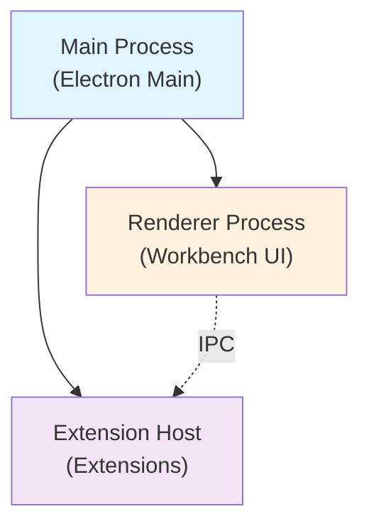

## Introduction

Visual Studio Code is built with a **layered architecture** using TypeScript, web APIs, and Electron. This architecture combines the flexibility of web technologies with the capabilities of native applications, enabling VS Code to run on desktop (Windows, macOS, Linux) and in the browser.

The codebase is organized into distinct architectural layers that promote separation of concerns, maintainability, and cross-platform compatibility.

## Core Principles

VS Code's architecture is built on three fundamental principles:

<AccordionGroup>
  <Accordion title="Layered Architecture">
    The codebase is organized into four primary layers, each with specific responsibilities:
    - **Base Layer**: Foundation utilities and cross-platform abstractions
    - **Platform Layer**: Platform services and dependency injection infrastructure
    - **Editor Layer**: Text editor implementation with language services
    - **Workbench Layer**: Main application UI and feature contributions
    
    Each layer can only depend on layers below it, never above, ensuring clean separation.
  </Accordion>

  <Accordion title="Dependency Injection">
    Services throughout VS Code are managed through a comprehensive dependency injection system:
    - Services are injected through constructor parameters
    - Service identifiers are created using decorators
    - The instantiation service manages service lifecycles
    - Non-service parameters must come after service parameters
    
    This enables loose coupling, testability, and dynamic service replacement.
  </Accordion>

  <Accordion title="Contribution Model">
    Features extend VS Code through a registry-based contribution system:
    - Components register themselves with extension points
    - Contributions are discovered and activated dynamically
    - Multiple contributions can extend the same extension point
    - Both internal and external extensions use the same model
    
    This allows for a highly extensible and modular architecture.
  </Accordion>
</AccordionGroup>

## Directory Structure

The source code is organized into the following key directories:

```plaintext
src/
├── vs/
│   ├── base/           # Foundation utilities
│   ├── platform/       # Platform services & DI
│   ├── editor/         # Monaco editor
│   ├── workbench/      # Main application
│   ├── code/           # Electron main process
│   └── server/         # Server implementation
├── build/              # Build scripts
├── extensions/         # Built-in extensions
├── test/              # Integration tests
└── scripts/           # Development scripts
```

### Source Code Organization

<Note>
  **Location**: All main TypeScript source code lives in `src/vs/`
  
  Unit tests are co-located with source files in `src/vs/*/test/` folders.
</Note>

<Steps>
  <Step title="Base Layer (src/vs/base/)">
    Contains foundation utilities and cross-platform abstractions:
    - Common utilities (arrays, strings, async, events)
    - Browser DOM utilities
    - Node.js-specific utilities
    - Data structures (maps, sets, trees)
    - Lifecycle management (disposables)
    
    **Example**: `src/vs/base/common/lifecycle.ts` provides the disposable pattern used throughout the codebase.
  </Step>

  <Step title="Platform Layer (src/vs/platform/)">
    Provides platform services and dependency injection infrastructure:
    - Core services (file system, configuration, logging)
    - Dependency injection framework
    - Service registries
    - Cross-platform abstractions for OS-specific functionality
    
    **Example**: `src/vs/platform/instantiation/` contains the DI system.
  </Step>

  <Step title="Editor Layer (src/vs/editor/)">
    Implements the Monaco text editor:
    - Core editing features
    - Language services integration
    - Syntax highlighting and tokenization
    - Code completion and IntelliSense
    - Editor widgets and decorations
    
    **Example**: The Monaco editor is a standalone component that can be used independently.
  </Step>

  <Step title="Workbench Layer (src/vs/workbench/)">
    The main application shell that brings everything together:
    - **browser/**: Core UI components (parts, layout, actions)
    - **services/**: Service implementations
    - **contrib/**: Feature contributions (git, debug, search, terminal)
    - **api/**: Extension host and VS Code API implementation
    
    **Example**: `src/vs/workbench/contrib/` contains all major features as contributions.
  </Step>
</Steps>

## Build Output

```typescript
out/               # Compiled JavaScript output (generated)
├── vs/           # Transpiled source code
├── bootstrap.js  # Entry point
└── main.js       # Main process entry
```

<Warning>
  The `out/` directory is generated during build and should never be edited directly. All changes must be made to TypeScript source files in `src/`.
</Warning>

## Built-in Extensions

VS Code ships with first-party extensions in the `extensions/` directory:

- **Language Support**: `typescript-language-features/`, `html-language-features/`, `css-language-features/`
- **Core Features**: `git/`, `debug-auto-launch/`, `emmet/`, `markdown-language-features/`
- **Themes**: `theme-*` folders for default color themes
- **Development Tools**: `extension-editing/`, `vscode-api-tests/`

Each extension follows the standard VS Code extension structure with `package.json`, TypeScript sources, and contribution points.

## Process Architecture

<Info>
  VS Code uses a multi-process architecture for stability and security:
</Info>



- **Main Process** (`src/vs/code/`): Manages windows, native menus, and system integration
- **Renderer Process** (`src/vs/workbench/`): Runs the UI and editor
- **Extension Host**: Isolated process for running extensions

## Cross-Platform Strategy

VS Code achieves cross-platform compatibility through:

1. **Abstraction Layers**: Platform-specific code is abstracted behind common interfaces
2. **Environment Detection**: Runtime checks for `isWindows`, `isLinux`, `isMacintosh`, `isWeb`, `isNative`
3. **Conditional Imports**: Platform-specific modules are loaded dynamically
4. **Web Compatibility**: Core components work in both Electron and browser environments

```typescript
// Example from src/vs/base/common/platform.ts
import { isWindows, isLinux, isWeb, isNative } from 'vs/base/common/platform';

if (isNative) {
  // Desktop-specific code
} else if (isWeb) {
  // Browser-specific code
}
```

## Configuration and Settings

Settings are managed through a layered configuration system:

- **Default Settings**: Built-in defaults
- **User Settings**: User-level preferences
- **Workspace Settings**: Project-specific settings
- **Folder Settings**: Multi-root workspace folder settings

The configuration service (`src/vs/platform/configuration/`) provides unified access to all settings.

## Next Steps

<CardGroup cols={2}>
  <Card title="Layered Architecture" icon="layer-group" href="/concepts/layered-architecture">
    Deep dive into the four architectural layers
  </Card>
  <Card title="Dependency Injection" icon="syringe" href="/concepts/dependency-injection">
    Learn how services are managed and injected
  </Card>
  <Card title="Contribution Model" icon="puzzle-piece" href="/concepts/contribution-model">
    Understand how features extend VS Code
  </Card>
  <Card title="Extension System" icon="plug" href="/concepts/extension-system">
    Explore how extensions work
  </Card>
</CardGroup>

## Key Files

| File | Description |
|------|-------------|
| `src/vs/workbench/browser/workbench.ts:131` | Main workbench initialization |
| `src/vs/platform/instantiation/common/instantiationService.ts` | Dependency injection implementation |
| `src/vs/platform/registry/common/platform.ts` | Registry system for contributions |
| `src/vs/base/common/lifecycle.ts` | Disposable pattern and lifecycle management |