## Introduction

Visual Studio Code's **contribution model** is a registry-based system that allows features to extend the application dynamically. Both internal features and external extensions use the same mechanism, creating a uniform and powerful extensibility model.

<Note>
  **Key files**:
  - `src/vs/platform/registry/common/platform.ts` - Core registry system
  - `src/vs/workbench/common/contributions.ts` - Workbench contributions
  - `src/vs/platform/actions/common/actions.ts` - Action/menu contributions
</Note>

## Core Concepts

### The Registry

The `Registry` is a global singleton that manages all contribution points:

```typescript
// src/vs/platform/registry/common/platform.ts:63
export interface IRegistry {
  // Register a contribution to an extension point
  add(id: string, data: any): void;
  
  // Check if an extension point exists
  knows(id: string): boolean;
  
  // Access contributions for an extension point
  as<T>(id: string): T;
}

export const Registry: IRegistry = new RegistryImpl();
```

### How It Works

<Steps>
  <Step title="Define Extension Point">
    An extension point is a registry entry that accepts contributions:
    
    ```typescript
    // Define the extension point interface
    export interface IWorkbenchContributionsRegistry {
      registerWorkbenchContribution(
        ctor: IConstructorSignature<IWorkbenchContribution>,
        phase: LifecyclePhase
      ): void;
    }
    
    // Define the extension point ID
    export namespace Extensions {
      export const Workbench = 'workbench.contributions.kind';
    }
    
    // Register the extension point
    Registry.add(Extensions.Workbench, workbenchContributionsRegistry);
    ```
  </Step>
  
  <Step title="Contribute to Extension Point">
    Features register themselves with extension points:
    
    ```typescript
    // Get the registry
    const registry = Registry.as<IWorkbenchContributionsRegistry>(
      Extensions.Workbench
    );
    
    // Register a contribution
    registry.registerWorkbenchContribution(
      MyFeature,
      LifecyclePhase.Restored
    );
    ```
  </Step>
  
  <Step title="Consume Contributions">
    The platform activates contributions at the appropriate time:
    
    ```typescript
    // From src/vs/workbench/browser/workbench.ts:162
    Registry.as<IWorkbenchContributionsRegistry>(
      WorkbenchExtensions.Workbench
    ).start(accessor);
    ```
  </Step>
</Steps>

## Workbench Contributions

Workbench contributions are the primary way features extend VS Code.

### Registration

```typescript
// src/vs/workbench/common/contributions.ts:420
import { registerWorkbenchContribution2 } from 'vs/workbench/common/contributions';

export class MyFeature extends Disposable implements IWorkbenchContribution {
  constructor(
    @ILogService private readonly logService: ILogService,
    @IConfigurationService private readonly configService: IConfigurationService
  ) {
    super();
    this.initialize();
  }
  
  private initialize(): void {
    this.logService.info('MyFeature initialized');
    
    // Register event listeners
    this._register(this.configService.onDidChangeConfiguration(e => {
      if (e.affectsConfiguration('myFeature')) {
        this.onConfigChanged();
      }
    }));
  }
  
  private onConfigChanged(): void {
    // Handle configuration changes
  }
}

// Register the contribution
registerWorkbenchContribution2(
  'myFeature',
  MyFeature,
  WorkbenchPhase.AfterRestored
);
```

### Instantiation Phases

<Tabs>
  <Tab title="BlockStartup">
    **Phase**: `WorkbenchPhase.BlockStartup` (`LifecyclePhase.Starting`)
    
    ```typescript
    registerWorkbenchContribution2(
      'criticalFeature',
      CriticalFeature,
      WorkbenchPhase.BlockStartup
    );
    ```
    
    <Warning>
      Use **very sparingly** - blocks the editor from showing.
      
      Only use for features that:
      - Must initialize before anything else
      - Are critical to application startup
      - Cannot work if initialized later
    </Warning>
  </Tab>
  
  <Tab title="BlockRestore">
    **Phase**: `WorkbenchPhase.BlockRestore` (`LifecyclePhase.Ready`)
    
    ```typescript
    registerWorkbenchContribution2(
      'layoutFeature',
      LayoutFeature,
      WorkbenchPhase.BlockRestore
    );
    ```
    
    Services are ready, window is about to restore UI state.
    
    <Warning>
      Also blocks editor display - use only when necessary.
    </Warning>
  </Tab>
  
  <Tab title="AfterRestored">
    **Phase**: `WorkbenchPhase.AfterRestored` (`LifecyclePhase.Restored`)
    
    ```typescript
    registerWorkbenchContribution2(
      undefined, // Anonymous contribution
      MyFeature,
      WorkbenchPhase.AfterRestored
    );
    ```
    
    <Info>
      **Preferred** for most features. Runs after:
      - Views, panels, and editors have restored
      - Editors have had time to restore content
      
      Contributions are instantiated during idle time.
    </Info>
  </Tab>
  
  <Tab title="Eventually">
    **Phase**: `WorkbenchPhase.Eventually` (`LifecyclePhase.Eventually`)
    
    ```typescript
    registerWorkbenchContribution2(
      'backgroundFeature',
      BackgroundFeature,
      WorkbenchPhase.Eventually
    );
    ```
    
    Runs 2-5 seconds after restoration, during idle time.
    
    Best for:
    - Non-critical features
    - Background tasks
    - Features that can wait
  </Tab>
  
  <Tab title="Lazy">
    **Mode**: `{ lazy: true }`
    
    ```typescript
    registerWorkbenchContribution2(
      'myLazyFeature',
      MyLazyFeature,
      { lazy: true }
    );
    
    // Explicitly get when needed
    const feature = getWorkbenchContribution<MyLazyFeature>('myLazyFeature');
    feature.doSomething();
    ```
    
    Instantiated only when explicitly requested via `getWorkbenchContribution()`.
  </Tab>
  
  <Tab title="OnEditor">
    **Mode**: `{ editorTypeId: string }`
    
    ```typescript
    registerWorkbenchContribution2(
      'myEditorFeature',
      MyEditorFeature,
      { editorTypeId: 'workbench.editor.notebook' }
    );
    ```
    
    Instantiated when a specific editor type is first created.
    
    Perfect for editor-specific features that:
    - Only apply to certain editor types
    - Should not load unless that editor is used
  </Tab>
</Tabs>

### Contribution Timing

```mermaid
gantt
    title VS Code Startup Timeline
    dateFormat X
    axisFormat %L ms
    
    section Startup
    BlockStartup     :crit, 0, 50
    BlockRestore     :crit, 50, 150
    Show Editor      :milestone, 150, 150
    
    section Restore
    AfterRestored    :active, 150, 500
    
    section Background
    Eventually       :500, 3000
```



<AccordionGroup>
  <Accordion title="Idle Time Instantiation">
    From `src/vs/workbench/common/contributions.ts:346`:
    
    ```typescript
    private doInstantiateWhenIdle(
      contributions: IWorkbenchContributionRegistration[],
      instantiationService: IInstantiationService,
      logService: ILogService,
      environmentService: IEnvironmentService,
      phase: LifecyclePhase
    ): void {
      let i = 0;
      const forcedTimeout = phase === LifecyclePhase.Eventually ? 3000 : 500;
      
      const instantiateSome = (idle: IdleDeadline) => {
        while (i < contributions.length) {
          const contribution = contributions[i++];
          this.safeCreateContribution(
            instantiationService,
            logService,
            environmentService,
            contribution,
            phase
          );
          
          if (idle.timeRemaining() < 1) {
            // Time is up -> reschedule
            runWhenGlobalIdle(instantiateSome, forcedTimeout);
            break;
          }
        }
      };
      
      runWhenGlobalIdle(instantiateSome, forcedTimeout);
    }
    ```
    
    This ensures contributions don't block the UI thread.
  </Accordion>
</AccordionGroup>

## Action Contributions

Actions (commands, menus, keybindings) use a specialized contribution system.

### Command Registration

```typescript
import { CommandsRegistry } from 'vs/platform/commands/common/commands';

CommandsRegistry.registerCommand({
  id: 'myExtension.myCommand',
  handler: (accessor: ServicesAccessor, ...args: any[]) => {
    const logService = accessor.get(ILogService);
    logService.info('Command executed');
  }
});
```

### Menu Contributions

```typescript
// src/vs/platform/actions/common/actions.ts
import { MenuRegistry, MenuId } from 'vs/platform/actions/common/actions';

MenuRegistry.appendMenuItem(MenuId.EditorContext, {
  command: {
    id: 'myExtension.myCommand',
    title: 'My Command',
    icon: ThemeIcon.asThemeIcon(Codicon.run)
  },
  group: 'navigation',
  order: 1,
  when: ContextKeyExpr.equals('resourceLangId', 'typescript')
});
```

### Menu IDs

<Info>
  VS Code defines numerous menu locations. From `src/vs/platform/actions/common/actions.ts:65`:
</Info>

```typescript
export class MenuId {
  static readonly CommandPalette = new MenuId('CommandPalette');
  static readonly EditorContext = new MenuId('EditorContext');
  static readonly EditorTitle = new MenuId('EditorTitle');
  static readonly EditorTitleContext = new MenuId('EditorTitleContext');
  static readonly ExplorerContext = new MenuId('ExplorerContext');
  static readonly SCMTitle = new MenuId('SCMTitle');
  static readonly DebugToolBar = new MenuId('DebugToolBar');
  static readonly ViewTitle = new MenuId('ViewTitle');
  // ... many more
}
```

### Keybinding Registration

```typescript
import { KeybindingsRegistry } from 'vs/platform/keybinding/common/keybindingsRegistry';
import { KeyCode, KeyMod } from 'vs/base/common/keyCodes';

KeybindingsRegistry.registerCommandAndKeybindingRule({
  id: 'myExtension.myCommand',
  weight: KeybindingWeight.WorkbenchContrib,
  when: ContextKeyExpr.equals('editorTextFocus', true),
  primary: KeyMod.CtrlCmd | KeyCode.KeyK,
  handler: (accessor: ServicesAccessor) => {
    // Command implementation
  }
});
```

## Context Keys

Context keys enable conditional contributions based on application state:

```typescript
import { RawContextKey, IContextKeyService } from 'vs/platform/contextkey/common/contextkey';

// Define context key
const MyFeatureEnabled = new RawContextKey<boolean>(
  'myFeature.enabled',
  false,
  'Whether my feature is enabled'
);

// Set context key value
export class MyFeature {
  private readonly contextKey: IContextKey<boolean>;
  
  constructor(
    @IContextKeyService contextKeyService: IContextKeyService
  ) {
    this.contextKey = MyFeatureEnabled.bindTo(contextKeyService);
    this.contextKey.set(true);
  }
}

// Use in menu contributions
MenuRegistry.appendMenuItem(MenuId.EditorContext, {
  command: { id: 'myCommand', title: 'My Command' },
  when: ContextKeyExpr.equals('myFeature.enabled', true)
});
```

### Context Key Expressions

```typescript
import { ContextKeyExpr } from 'vs/platform/contextkey/common/contextkey';

// Simple equality
ContextKeyExpr.equals('editorLangId', 'typescript');

// Boolean check
ContextKeyExpr.has('editorTextFocus');

// Negation
ContextKeyExpr.not('editorReadonly');

// Complex expressions
ContextKeyExpr.and(
  ContextKeyExpr.equals('editorLangId', 'typescript'),
  ContextKeyExpr.has('editorTextFocus'),
  ContextKeyExpr.not('editorReadonly')
);

// OR expressions
ContextKeyExpr.or(
  ContextKeyExpr.equals('editorLangId', 'javascript'),
  ContextKeyExpr.equals('editorLangId', 'typescript')
);
```

## Extension Points

### Common Extension Points

<CardGroup cols={2}>
  <Card title="Workbench Contributions" icon="layer-group">
    Main application features
    
    `Extensions.Workbench`
  </Card>
  
  <Card title="Editor Contributions" icon="file-code">
    Editor-specific features
    
    `EditorExtensions.EditorCommonContributions`
  </Card>
  
  <Card title="Configuration" icon="gear">
    Settings and preferences
    
    `Extensions.Configuration`
  </Card>
  
  <Card title="JSON Validation" icon="check">
    JSON schema validators
    
    `Extensions.JSONValidation`
  </Card>
  
  <Card title="Language Features" icon="language">
    Language support
    
    `Extensions.LanguageFeatures`
  </Card>
  
  <Card title="Output Channels" icon="terminal">
    Output panel channels
    
    `Extensions.OutputChannels`
  </Card>
</CardGroup>

## Example: Full Feature Contribution

Here's a complete example of a feature using the contribution model:

```typescript
// 1. Define interfaces and identifiers
import { createDecorator } from 'vs/platform/instantiation/common/instantiation';

export const IMyFeatureService = createDecorator<IMyFeatureService>('myFeatureService');

export interface IMyFeatureService {
  readonly _serviceBrand: undefined;
  performAction(): Promise<void>;
}

// 2. Implement the service
import { Disposable } from 'vs/base/common/lifecycle';
import { ILogService } from 'vs/platform/log/common/log';

export class MyFeatureService extends Disposable implements IMyFeatureService {
  declare readonly _serviceBrand: undefined;
  
  constructor(
    @ILogService private readonly logService: ILogService
  ) {
    super();
  }
  
  async performAction(): Promise<void> {
    this.logService.info('Action performed');
  }
}

// 3. Register the service
import { registerSingleton, InstantiationType } from 'vs/platform/instantiation/common/extensions';

registerSingleton(
  IMyFeatureService,
  MyFeatureService,
  InstantiationType.Delayed
);

// 4. Create workbench contribution
import { registerWorkbenchContribution2, WorkbenchPhase } from 'vs/workbench/common/contributions';
import { IConfigurationService } from 'vs/platform/configuration/common/configuration';

class MyFeatureContribution extends Disposable implements IWorkbenchContribution {
  constructor(
    @IMyFeatureService private readonly myFeatureService: IMyFeatureService,
    @IConfigurationService private readonly configService: IConfigurationService
  ) {
    super();
    this.initialize();
  }
  
  private initialize(): void {
    // Set up event listeners
    this._register(this.configService.onDidChangeConfiguration(e => {
      if (e.affectsConfiguration('myFeature')) {
        this.myFeatureService.performAction();
      }
    }));
  }
}

registerWorkbenchContribution2(
  'myFeatureContribution',
  MyFeatureContribution,
  WorkbenchPhase.AfterRestored
);

// 5. Register commands
import { CommandsRegistry } from 'vs/platform/commands/common/commands';
import { ServicesAccessor } from 'vs/platform/instantiation/common/instantiation';

CommandsRegistry.registerCommand({
  id: 'myFeature.performAction',
  handler: async (accessor: ServicesAccessor) => {
    const myFeatureService = accessor.get(IMyFeatureService);
    await myFeatureService.performAction();
  }
});

// 6. Register menu items
import { MenuRegistry, MenuId } from 'vs/platform/actions/common/actions';
import { ContextKeyExpr } from 'vs/platform/contextkey/common/contextkey';

MenuRegistry.appendMenuItem(MenuId.CommandPalette, {
  command: {
    id: 'myFeature.performAction',
    title: { value: 'My Feature: Perform Action', original: 'My Feature: Perform Action' }
  },
  when: ContextKeyExpr.true()
});

// 7. Register keybindings
import { KeybindingsRegistry } from 'vs/platform/keybinding/common/keybindingsRegistry';
import { KeyCode, KeyMod } from 'vs/base/common/keyCodes';

KeybindingsRegistry.registerKeybindingRule({
  id: 'myFeature.performAction',
  weight: KeybindingWeight.WorkbenchContrib,
  when: ContextKeyExpr.true(),
  primary: KeyMod.CtrlCmd | KeyMod.Shift | KeyCode.KeyP
});
```

## Best Practices

<AccordionGroup>
  <Accordion title="Choose the Right Phase">
    - Use `AfterRestored` or `Eventually` for most features
    - Only use blocking phases when absolutely necessary
    - Consider lazy loading for rarely-used features
    - Use editor-specific loading when possible
  </Accordion>
  
  <Accordion title="Minimize Startup Impact">
    ```typescript
    // Good: Light initialization
    constructor(
      @IContextKeyService contextKeyService: IContextKeyService
    ) {
      super();
      // Just set up basic state
      this.initializeContextKeys(contextKeyService);
    }
    
    // Bad: Heavy work in constructor
    constructor() {
      super();
      this.loadLargeDataset(); // Don't do this!
      this.performExpensiveOperation(); // Or this!
    }
    ```
  </Accordion>
  
  <Accordion title="Clean Up Resources">
    ```typescript
    export class MyContribution extends Disposable {
      constructor(
        @IFileService private readonly fileService: IFileService
      ) {
        super();
        
        // Always register disposables
        this._register(this.fileService.onDidFilesChange(() => {
          this.handleFileChange();
        }));
      }
    }
    ```
  </Accordion>
  
  <Accordion title="Use Context Keys Wisely">
    - Define clear, semantic context key names
    - Update context keys when state changes
    - Use context keys to show/hide UI elements conditionally
  </Accordion>
</AccordionGroup>

## Performance Monitoring

```typescript
// VS Code tracks contribution timing
// From src/vs/workbench/common/contributions.ts:397
const now = Date.now();
const instance = instantiationService.createInstance(contribution.ctor);
const time = Date.now() - now;

if (time > WARN_THRESHOLD) {
  logService.warn(
    `Creation of workbench contribution '${contribution.id}' took ${time}ms.`
  );
}
```

<Info>
  Monitor contribution performance using:
  - `Developer: Startup Performance` command
  - Chrome DevTools Performance profiler
  - VS Code's built-in performance marks
</Info>

## Next Steps

<CardGroup cols={2}>
  <Card title="Extension System" icon="plug" href="/concepts/extension-system">
    Learn how external extensions contribute
  </Card>
  <Card title="Layered Architecture" icon="layer-group" href="/concepts/layered-architecture">
    Understand where contributions fit
  </Card>
</CardGroup>