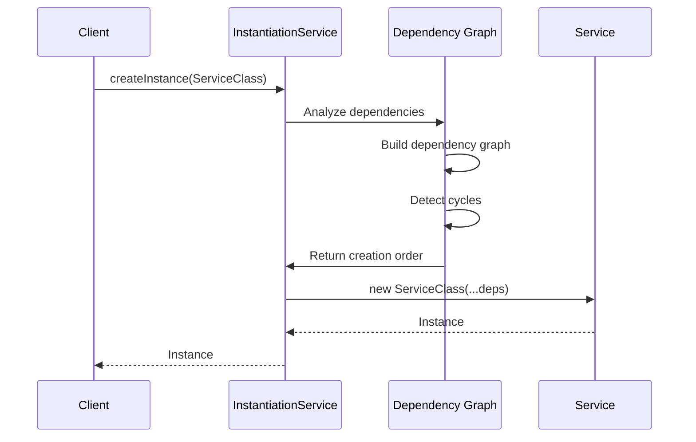

## Introduction

Visual Studio Code uses a comprehensive **dependency injection (DI)** system to manage services throughout the application. This system enables loose coupling, testability, and dynamic service replacement.

<Note>
  **Key files**: 
  - `src/vs/platform/instantiation/common/instantiation.ts` - DI interfaces
  - `src/vs/platform/instantiation/common/instantiationService.ts` - DI implementation
  - `src/vs/platform/instantiation/common/descriptors.ts` - Service descriptors
</Note>

## Core Concepts

### Service Identifiers

Services are identified using unique **service identifiers** created with the `createDecorator` function:

```typescript
// src/vs/platform/instantiation/common/instantiation.ts:109
import { createDecorator } from 'vs/platform/instantiation/common/instantiation';

// Define the service identifier
export const IMyService = createDecorator<IMyService>('myService');

// Define the service interface
export interface IMyService {
  readonly _serviceBrand: undefined; // Brand for type safety
  doSomething(): void;
  getValue(): string;
}
```

<AccordionGroup>
  <Accordion title="Why Service Identifiers?">
    Service identifiers serve multiple purposes:
    
    1. **Type Safety**: TypeScript ensures you inject the correct service type
    2. **Runtime Resolution**: The DI container looks up services by identifier
    3. **Decoration**: The identifier acts as a parameter decorator for injection
    4. **Uniqueness**: String IDs prevent naming collisions
    
    ```typescript
    // The identifier is both a type and a decorator
    function (target: Function, key: string, index: number) {
      // Stores dependency metadata
    }
    ```
  </Accordion>
  
  <Accordion title="The _serviceBrand Property">
    Every service interface must include `readonly _serviceBrand: undefined`:
    
    ```typescript
    export interface IMyService {
      readonly _serviceBrand: undefined;
      // ... methods
    }
    ```
    
    This is a TypeScript branding technique that:
    - Prevents different services from being structurally compatible
    - Ensures type safety even if two services have identical methods
    - Is never implemented (it's just for the type system)
  </Accordion>
</AccordionGroup>

## Service Implementation

### Basic Service

Here's how to implement a service:

<Steps>
  <Step title="Define the Service Interface">
    ```typescript
    // myService.ts
    import { createDecorator } from 'vs/platform/instantiation/common/instantiation';
    
    export const IMyService = createDecorator<IMyService>('myService');
    
    export interface IMyService {
      readonly _serviceBrand: undefined;
      processData(data: string): Promise<string>;
    }
    ```
  </Step>
  
  <Step title="Implement the Service">
    ```typescript
    import { ILogService } from 'vs/platform/log/common/log';
    import { IFileService } from 'vs/platform/files/common/files';
    
    export class MyService implements IMyService {
      declare readonly _serviceBrand: undefined;
      
      constructor(
        @ILogService private readonly logService: ILogService,
        @IFileService private readonly fileService: IFileService
      ) {
        this.logService.info('MyService initialized');
      }
      
      async processData(data: string): Promise<string> {
        this.logService.info('Processing data');
        // Use injected services
        return data.toUpperCase();
      }
    }
    ```
    
    <Info>
      **Important**: Service dependencies are declared using the `@IServiceName` decorator syntax. The DI container will automatically inject these dependencies.
    </Info>
  </Step>
  
  <Step title="Register the Service">
    ```typescript
    // In a registration file (e.g., workbench.common.main.ts)
    import { registerSingleton } from 'vs/platform/instantiation/common/extensions';
    import { IMyService, MyService } from './myService';
    
    registerSingleton(IMyService, MyService, InstantiationType.Delayed);
    ```
  </Step>
</Steps>

### Service with Non-Service Parameters

<Warning>
  **Critical Rule**: Non-service parameters MUST come BEFORE service parameters in the constructor.
</Warning>

```typescript
export class ConfigurableService implements IConfigurableService {
  declare readonly _serviceBrand: undefined;
  
  constructor(
    // Non-service parameters come first
    private readonly configValue: string,
    private readonly options: IOptions,
    // Service parameters come after
    @ILogService private readonly logService: ILogService,
    @IFileService private readonly fileService: IFileService
  ) {
    this.logService.info(`ConfigurableService with ${configValue}`);
  }
}

// When creating instances:
const instance = instantiationService.createInstance(
  ConfigurableService,
  'myConfig',      // Non-service arg
  { enabled: true } // Non-service arg
  // Services are injected automatically
);
```

## Instantiation Service

The `IInstantiationService` is the heart of the DI system:

```typescript
// src/vs/platform/instantiation/common/instantiation.ts:52
export interface IInstantiationService {
  readonly _serviceBrand: undefined;
  
  // Create an instance with dependencies injected
  createInstance<T>(ctor: new (...args: any[]) => T, ...args: any[]): T;
  
  // Invoke a function with service access
  invokeFunction<R>(fn: (accessor: ServicesAccessor, ...args: any[]) => R, ...args: any[]): R;
  
  // Create a child container with additional services
  createChild(services: ServiceCollection, store?: DisposableStore): IInstantiationService;
  
  // Dispose the instantiation service and all created services
  dispose(): void;
}
```

### Creating Instances

<Tabs>
  <Tab title="createInstance">
    ```typescript
    // Create an instance with automatic dependency injection
    const myService = instantiationService.createInstance(MyService);
    
    // With additional constructor arguments
    const configured = instantiationService.createInstance(
      ConfigurableService,
      'config-value',
      { option: true }
    );
    ```
    
    The instantiation service:
    1. Analyzes constructor parameters
    2. Resolves service dependencies from the container
    3. Injects services after non-service parameters
    4. Constructs and returns the instance
  </Tab>
  
  <Tab title="invokeFunction">
    ```typescript
    // Execute a function with access to services
    const result = instantiationService.invokeFunction(accessor => {
      const logService = accessor.get(ILogService);
      const fileService = accessor.get(IFileService);
      
      logService.info('Executing function');
      return fileService.exists(someUri);
    });
    ```
    
    Use `invokeFunction` when:
    - You need services temporarily
    - You're not creating a class instance
    - You want explicit service access
  </Tab>
  
  <Tab title="createChild">
    ```typescript
    // Create a scoped container with additional services
    const childServices = new ServiceCollection();
    childServices.set(IScopedService, new ScopedService());
    
    const childContainer = instantiationService.createChild(childServices);
    
    // Use child container - it inherits parent services
    const instance = childContainer.createInstance(MyComponent);
    
    // Dispose when done - cleans up child services only
    childContainer.dispose();
    ```
    
    <Info>
      Child containers are useful for:
      - Scoped service lifetimes
      - Testing with mock services
      - Editor or view-specific services
    </Info>
  </Tab>
</Tabs>

## Service Registration

Services are registered using the `registerSingleton` function:

```typescript
import { 
  registerSingleton, 
  InstantiationType 
} from 'vs/platform/instantiation/common/extensions';

// Eager instantiation - created immediately at startup
registerSingleton(
  IMyService, 
  MyService, 
  InstantiationType.Eager
);

// Delayed instantiation - created when first requested
registerSingleton(
  IMyService, 
  MyService, 
  InstantiationType.Delayed
);
```

<AccordionGroup>
  <Accordion title="InstantiationType.Eager">
    Service is created during application startup:
    
    ```typescript
    registerSingleton(ILifecycleService, LifecycleService, InstantiationType.Eager);
    ```
    
    Use for services that:
    - Must be initialized early
    - Have critical startup logic
    - Are always needed
  </Accordion>
  
  <Accordion title="InstantiationType.Delayed">
    Service is created lazily when first requested:
    
    ```typescript
    registerSingleton(ISearchService, SearchService, InstantiationType.Delayed);
    ```
    
    This is the **preferred** option because:
    - Faster startup time
    - Lower initial memory usage
    - Services only created if actually needed
    
    For delayed services, VS Code uses a **proxy pattern**:
    ```typescript
    // From src/vs/platform/instantiation/common/instantiationService.ts:333
    return new Proxy(Object.create(null), {
      get(target: any, key: PropertyKey): unknown {
        // Lazy initialization on first property access
        if (!idle.isInitialized) {
          // Handle events specially
          if (typeof key === 'string' && (key.startsWith('onDid') || key.startsWith('onWill'))) {
            // Queue event listeners until service is created
          }
        }
        
        // Create actual instance
        const obj = idle.value;
        let prop = obj[key];
        if (typeof prop !== 'function') {
          return prop;
        }
        prop = prop.bind(obj);
        target[key] = prop;
        return prop;
      }
    });
    ```
  </Accordion>
</AccordionGroup>

## Service Descriptors

For more complex registration scenarios, use `SyncDescriptor`:

```typescript
// src/vs/platform/instantiation/common/descriptors.ts:6
import { SyncDescriptor } from 'vs/platform/instantiation/common/descriptors';

// Register with static arguments
const descriptor = new SyncDescriptor(
  MyService,
  ['static-arg-1', 'static-arg-2'],
  true // supportsDelayedInstantiation
);

serviceCollection.set(IMyService, descriptor);
```

## Dependency Resolution

The instantiation service resolves dependencies using a **graph-based algorithm**:

<Steps>
  <Step title="Analyze Dependencies">
    ```typescript
    // src/vs/platform/instantiation/common/instantiationService.ts:236
    for (const dependency of _util.getServiceDependencies(item.desc.ctor)) {
      const instanceOrDesc = this._getServiceInstanceOrDescriptor(dependency.id);
      
      if (!instanceOrDesc) {
        this._throwIfStrict(
          `${id} depends on ${dependency.id} which is NOT registered.`,
          true
        );
      }
      
      if (instanceOrDesc instanceof SyncDescriptor) {
        // Add to dependency graph
        graph.insertEdge(item, { id: dependency.id, desc: instanceOrDesc });
        stack.push(d);
      }
    }
    ```
  </Step>
  
  <Step title="Detect Cycles">
    ```typescript
    // src/vs/platform/instantiation/common/instantiationService.ts:258
    const roots = graph.roots();
    
    if (roots.length === 0) {
      if (!graph.isEmpty()) {
        throw new CyclicDependencyError(graph);
      }
      break;
    }
    ```
    
    <Warning>
      Circular dependencies between services will throw a `CyclicDependencyError`. The error message includes the dependency chain.
    </Warning>
  </Step>
  
  <Step title="Instantiate in Order">
    ```typescript
    // Create services in dependency order
    for (const { data } of roots) {
      const instance = this._createServiceInstanceWithOwner(
        data.id,
        data.desc.ctor,
        data.desc.staticArguments,
        data.desc.supportsDelayedInstantiation,
        data._trace
      );
      this._setCreatedServiceInstance(data.id, instance);
      graph.removeNode(data);
    }
    ```
  </Step>
</Steps>

## Service Lifecycle

### Service Creation



### Service Disposal

```typescript
// src/vs/platform/instantiation/common/instantiationService.ts:50
dispose(): void {
  if (!this._isDisposed) {
    this._isDisposed = true;
    // Dispose all child containers
    dispose(this._children);
    this._children.clear();
    
    // Dispose all services created by this container
    for (const candidate of this._servicesToMaybeDispose) {
      if (isDisposable(candidate)) {
        candidate.dispose();
      }
    }
    this._servicesToMaybeDispose.clear();
  }
}
```

<Info>
  Services that implement `IDisposable` are automatically disposed when the instantiation service is disposed.
</Info>

## Testing with DI

The DI system makes testing easy:

```typescript
import { TestInstantiationService } from 'vs/platform/instantiation/test/common/instantiationServiceMock';

suite('MyService', () => {
  let instantiationService: TestInstantiationService;
  let myService: IMyService;
  
  setup(() => {
    instantiationService = new TestInstantiationService();
    
    // Register mock services
    instantiationService.stub(ILogService, new MockLogService());
    instantiationService.stub(IFileService, new MockFileService());
    
    // Create service under test
    myService = instantiationService.createInstance(MyService);
  });
  
  test('should process data', async () => {
    const result = await myService.processData('test');
    assert.strictEqual(result, 'TEST');
  });
});
```

## Best Practices

<AccordionGroup>
  <Accordion title="Use Interfaces, Not Implementations">
    ```typescript
    // Good: Depend on interface
    constructor(
      @ILogService private readonly logService: ILogService
    ) {}
    
    // Bad: Depend on concrete class
    constructor(
      private readonly logService: LogService // Don't do this
    ) {}
    ```
  </Accordion>
  
  <Accordion title="Prefer Delayed Instantiation">
    ```typescript
    // Preferred: Lazy loading
    registerSingleton(IMyService, MyService, InstantiationType.Delayed);
    
    // Only if truly necessary
    registerSingleton(ICriticalService, CriticalService, InstantiationType.Eager);
    ```
  </Accordion>
  
  <Accordion title="Keep Services Focused">
    Follow the Single Responsibility Principle:
    - Each service should have one clear purpose
    - Large services should be split into smaller ones
    - Use service composition for complex behavior
  </Accordion>
  
  <Accordion title="Handle Disposal">
    ```typescript
    export class MyService extends Disposable implements IMyService {
      declare readonly _serviceBrand: undefined;
      
      constructor(
        @IFileService private readonly fileService: IFileService
      ) {
        super();
        
        // Register disposables
        this._register(this.fileService.onDidFilesChange(() => {
          // Handle changes
        }));
      }
    }
    ```
  </Accordion>
</AccordionGroup>

## Common Patterns

### Optional Service Dependencies

```typescript
import { optional } from 'vs/platform/instantiation/common/instantiation';

export class MyService implements IMyService {
  constructor(
    @ILogService private readonly logService: ILogService,
    @optional(ITelemetryService) private readonly telemetryService: ITelemetryService | undefined
  ) {
    if (this.telemetryService) {
      this.telemetryService.publicLog('service.created');
    }
  }
}
```

### Service Accessor Pattern

```typescript
// Use accessor when you need multiple services temporarily
export function myFunction(accessor: ServicesAccessor, arg: string): void {
  const logService = accessor.get(ILogService);
  const configService = accessor.get(IConfigurationService);
  
  const value = configService.getValue<string>('my.setting');
  logService.info(`Processing ${arg} with ${value}`);
}

// Call via instantiation service
instantiationService.invokeFunction(myFunction, 'test-arg');
```

## Next Steps

<CardGroup cols={2}>
  <Card title="Contribution Model" icon="puzzle-piece" href="/concepts/contribution-model">
    Learn how features register with the DI system
  </Card>
  <Card title="Extension System" icon="plug" href="/concepts/extension-system">
    Understand how extensions use services
  </Card>
</CardGroup>