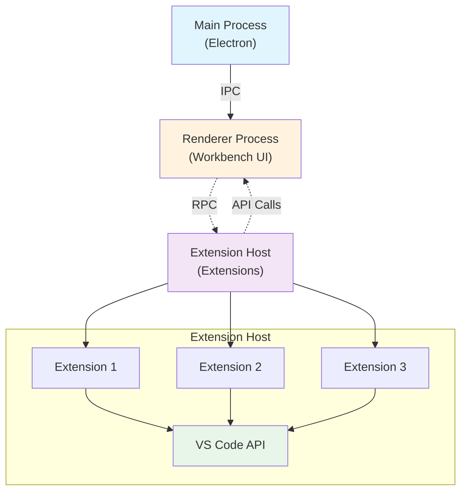
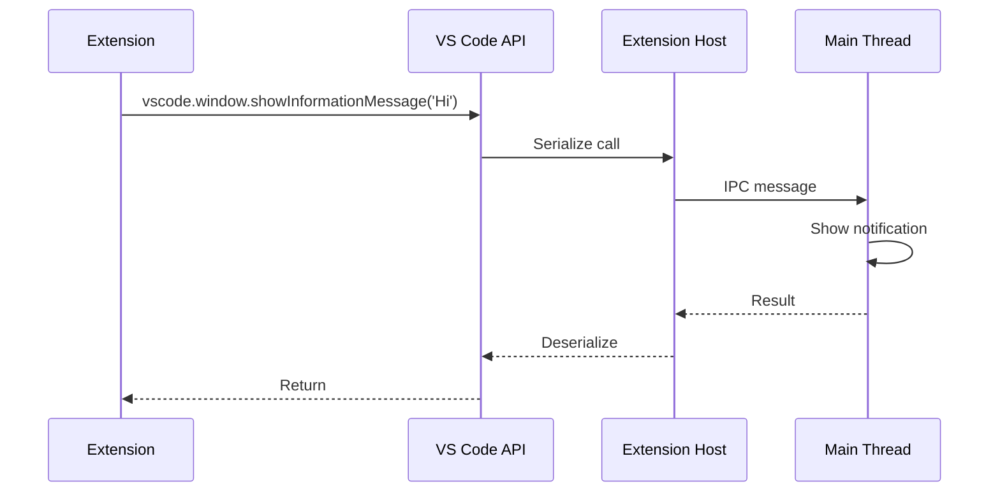

## Introduction

Visual Studio Code's **extension system** allows third-party developers to extend the editor's functionality while maintaining stability and security. Extensions run in a separate process (the extension host) and communicate with the main VS Code process through a well-defined API.

<Note>
  **Key files**:
  - `src/vs/workbench/services/extensions/common/extensions.ts` - Extension service interfaces
  - `src/vs/workbench/api/` - Extension API implementation
  - `src/vs/workbench/services/extensions/` - Extension host management
</Note>

## Architecture Overview



### Process Isolation

Extensions run in a **separate process** for several reasons:

<AccordionGroup>
  <Accordion title="Stability">
    If an extension crashes, it doesn't take down the entire application:
    
    ```typescript
    // From src/vs/workbench/services/extensions/common/extensions.ts:122
    export interface IExtensionHost {
      readonly pid: number | null;
      readonly onExit: Event<[number, string | null]>;
      
      start(): Promise<IMessagePassingProtocol>;
      dispose(): void;
    }
    ```
    
    The workbench can detect when an extension host exits and restart it if necessary.
  </Accordion>
  
  <Accordion title="Performance">
    Extensions can perform CPU-intensive operations without blocking the UI:
    - Heavy computations
    - File system operations
    - Network requests
    
    The UI remains responsive because it runs in a different process.
  </Accordion>
  
  <Accordion title="Security">
    Extensions have limited access to system resources:
    - No direct DOM access
    - Controlled file system access through APIs
    - Cannot interfere with other extensions
    - API surface is explicitly defined and versioned
  </Accordion>
</AccordionGroup>

## Extension Manifest

Every extension has a `package.json` that describes its capabilities:

```json
{
  "name": "my-extension",
  "publisher": "publisher-name",
  "version": "1.0.0",
  "engines": {
    "vscode": "^1.80.0"
  },
  "activationEvents": [
    "onLanguage:typescript",
    "onCommand:myExtension.doSomething"
  ],
  "main": "./out/extension.js",
  "contributes": {
    "commands": [{
      "command": "myExtension.doSomething",
      "title": "Do Something"
    }],
    "languages": [{
      "id": "mylang",
      "extensions": [".mylang"]
    }],
    "menus": {
      "editor/context": [{
        "command": "myExtension.doSomething",
        "when": "editorLangId == typescript"
      }]
    }
  }
}
```

### Activation Events

Extensions are **lazily activated** based on activation events:

<Tabs>
  <Tab title="onLanguage">
    ```json
    "activationEvents": [
      "onLanguage:typescript"
    ]
    ```
    
    Activates when a file of the specified language is opened.
  </Tab>
  
  <Tab title="onCommand">
    ```json
    "activationEvents": [
      "onCommand:myExtension.myCommand"
    ]
    ```
    
    Activates when the command is invoked.
    
    <Info>
      Most commands don't need explicit activation events - VS Code automatically adds them.
    </Info>
  </Tab>
  
  <Tab title="onFileSystem">
    ```json
    "activationEvents": [
      "onFileSystem:sftp"
    ]
    ```
    
    Activates when a file from a custom file system is accessed.
  </Tab>
  
  <Tab title="onView">
    ```json
    "activationEvents": [
      "onView:myCustomView"
    ]
    ```
    
    Activates when a contributed view becomes visible.
  </Tab>
  
  <Tab title="onStartup">
    ```json
    "activationEvents": [
      "onStartupFinished"
    ]
    ```
    
    <Warning>
      Activates shortly after VS Code starts. Use sparingly as it impacts startup time.
    </Warning>
  </Tab>
  
  <Tab title="*">
    ```json
    "activationEvents": [
      "*"
    ]
    ```
    
    <Warning>
      **Deprecated**. Activates on startup. Seriously impacts performance. Avoid unless absolutely necessary.
    </Warning>
  </Tab>
</Tabs>

## Extension Lifecycle

<Steps>
  <Step title="Discovery">
    VS Code scans for extensions in:
    - User extensions directory (`~/.vscode/extensions`)
    - Built-in extensions (`extensions/` in installation)
    - Workspace extensions (`.vscode/extensions` in workspace)
    
    ```typescript
    // Extension metadata is loaded
    export interface IExtensionDescription {
      readonly identifier: ExtensionIdentifier;
      readonly name: string;
      readonly version: string;
      readonly publisher: string;
      readonly engines: { vscode: string };
      readonly extensionLocation: URI;
      readonly isBuiltin: boolean;
      // ... more properties
    }
    ```
  </Step>
  
  <Step title="Registration">
    Extension contributions are registered with VS Code:
    
    ```typescript
    // From src/vs/workbench/services/extensions/common/extensions.ts:38
    export const IExtensionService = createDecorator<IExtensionService>('extensionService');
    
    export interface IExtensionService {
      // All registered extensions
      readonly extensions: readonly IExtensionDescription[];
      
      // Event when extensions are registered
      readonly onDidRegisterExtensions: Event<void>;
      
      // Activate an extension
      activateByEvent(activationEvent: string): Promise<void>;
    }
    ```
  </Step>
  
  <Step title="Activation">
    When an activation event fires:
    
    ```typescript
    // 1. Extension host loads the extension module
    const extensionModule = await import(extensionPath);
    
    // 2. Call the activate function
    const api = await extensionModule.activate(context);
    
    // 3. Track activation
    interface ActivationTimes {
      readonly codeLoadingTime: number;
      readonly activateCallTime: number;
      readonly activateResolvedTime: number;
    }
    ```
    
    The extension's `activate` function is called with a context:
    
    ```typescript
    export function activate(context: vscode.ExtensionContext) {
      console.log('Extension activated!');
      
      // Register commands
      const disposable = vscode.commands.registerCommand(
        'myExtension.doSomething',
        () => {
          vscode.window.showInformationMessage('Hello!');
        }
      );
      
      context.subscriptions.push(disposable);
      
      // Return public API (optional)
      return {
        doSomething() {
          // Public API for other extensions
        }
      };
    }
    ```
  </Step>
  
  <Step title="Deactivation">
    When VS Code shuts down or the extension is disabled:
    
    ```typescript
    export function deactivate() {
      // Clean up resources
      // Dispose of subscriptions
      // Close connections
    }
    ```
    
    <Info>
      Resources registered with `context.subscriptions` are automatically disposed.
    </Info>
  </Step>
</Steps>

## Extension Host

### Extension Host Types

VS Code can run multiple extension hosts:

```typescript
// From src/vs/workbench/services/extensions/common/extensionHostKind.ts
export enum ExtensionHostKind {
  LocalProcess = 1,      // Separate Node.js process
  LocalWebWorker = 2,    // Web Worker in browser
  Remote = 3             // Remote machine
}
```

<Tabs>
  <Tab title="Local Process">
    Default for desktop VS Code:
    - Runs in a separate Node.js process
    - Full Node.js API access
    - Best performance for compute-intensive tasks
    
    ```typescript
    // Extensions run in this host by default
    {
      "main": "./out/extension.js"
    }
    ```
  </Tab>
  
  <Tab title="Web Worker">
    For browser-based VS Code (vscode.dev):
    - Runs in a Web Worker
    - No Node.js APIs
    - Limited file system access
    
    ```json
    {
      "browser": "./dist/web/extension.js"
    }
    ```
  </Tab>
  
  <Tab title="Remote">
    For remote development:
    - Runs on the remote machine
    - Access to remote file system
    - Can use remote tools and runtimes
    
    Extensions can specify where they prefer to run:
    ```json
    {
      "extensionKind": ["workspace", "ui"]
    }
    ```
  </Tab>
</Tabs>

### Extension Host Communication

Extensions communicate with VS Code through **RPC (Remote Procedure Call)**:

```typescript
// Extension makes an API call
const document = await vscode.workspace.openTextDocument(uri);

// This translates to:
// 1. Serialize the request
// 2. Send message to main thread via IPC
// 3. Main thread performs operation
// 4. Send result back to extension host
// 5. Deserialize and return to extension
```



## VS Code API

The VS Code API is the **only** interface extensions have to VS Code:

### Core Namespaces

<CardGroup cols={2}>
  <Card title="commands" icon="terminal">
    Register and execute commands
    
    ```typescript
    vscode.commands.registerCommand(
      'myExt.cmd',
      () => { /* ... */ }
    );
    ```
  </Card>
  
  <Card title="window" icon="window">
    Interact with the editor window
    
    ```typescript
    vscode.window.showInformationMessage('Hi');
    vscode.window.createOutputChannel('My Output');
    ```
  </Card>
  
  <Card title="workspace" icon="folder">
    Access workspace files and settings
    
    ```typescript
    const config = vscode.workspace.getConfiguration();
    const files = await vscode.workspace.findFiles('**/*.ts');
    ```
  </Card>
  
  <Card title="languages" icon="language">
    Register language features
    
    ```typescript
    vscode.languages.registerCompletionItemProvider(
      'typescript',
      completionProvider
    );
    ```
  </Card>
  
  <Card title="debug" icon="bug">
    Debugging support
    
    ```typescript
    vscode.debug.startDebugging(
      workspace,
      debugConfig
    );
    ```
  </Card>
  
  <Card title="extensions" icon="puzzle-piece">
    Access other extensions
    
    ```typescript
    const ext = vscode.extensions.getExtension('pub.ext');
    const api = ext?.exports;
    ```
  </Card>
</CardGroup>

### API Implementation

The API is implemented in `src/vs/workbench/api/`:

```typescript
// From src/vs/workbench/api/common/extHostCommands.ts
export class ExtHostCommands {
  private readonly _commands = new Map<string, Function>();
  
  registerCommand(
    id: string,
    callback: <T>(...args: any[]) => T | Thenable<T>
  ): vscode.Disposable {
    this._commands.set(id, callback);
    
    // Tell main thread about the command
    this._proxy.$registerCommand(id);
    
    return {
      dispose: () => {
        this._commands.delete(id);
        this._proxy.$unregisterCommand(id);
      }
    };
  }
  
  executeCommand<T>(id: string, ...args: any[]): Thenable<T> {
    // Check if it's an extension command
    const command = this._commands.get(id);
    if (command) {
      return Promise.resolve(command(...args));
    }
    
    // Ask main thread to execute
    return this._proxy.$executeCommand(id, args);
  }
}
```

## Extension Contributions

Extensions extend VS Code through **contribution points** defined in `package.json`:

### Commands

```json
{
  "contributes": {
    "commands": [{
      "command": "myExtension.action",
      "title": "My Action",
      "category": "My Extension",
      "icon": "$(rocket)"
    }]
  }
}
```

```typescript
// In extension code
export function activate(context: vscode.ExtensionContext) {
  context.subscriptions.push(
    vscode.commands.registerCommand('myExtension.action', () => {
      vscode.window.showInformationMessage('Action executed!');
    })
  );
}
```

### Menus

```json
{
  "contributes": {
    "menus": {
      "editor/context": [{
        "command": "myExtension.action",
        "when": "editorLangId == typescript",
        "group": "navigation"
      }],
      "explorer/context": [{
        "command": "myExtension.action",
        "when": "resourceExtname == .ts"
      }]
    }
  }
}
```

### Languages

```json
{
  "contributes": {
    "languages": [{
      "id": "mylang",
      "aliases": ["MyLang", "mylang"],
      "extensions": [".mylang"],
      "configuration": "./language-configuration.json"
    }],
    "grammars": [{
      "language": "mylang",
      "scopeName": "source.mylang",
      "path": "./syntaxes/mylang.tmLanguage.json"
    }]
  }
}
```

### Views

```json
{
  "contributes": {
    "views": {
      "explorer": [{
        "id": "myView",
        "name": "My View"
      }]
    },
    "viewsContainers": {
      "activitybar": [{
        "id": "myContainer",
        "title": "My Container",
        "icon": "resources/icon.svg"
      }]
    }
  }
}
```

```typescript
// Register tree view provider
const treeDataProvider = new MyTreeDataProvider();
vscode.window.registerTreeDataProvider('myView', treeDataProvider);
```

## Extension Dependencies

Extensions can depend on other extensions:

```json
{
  "extensionDependencies": [
    "publisher.extension-id"
  ]
}
```

<Warning>
  Dependencies are activated before the dependent extension:
  
  ```typescript
  // From src/vs/workbench/services/extensions/common/extensions.ts:56
  export class MissingExtensionDependency {
    constructor(readonly dependency: string) { }
  }
  ```
  
  If a dependency is missing, the extension won't activate.
</Warning>

### Extension API Export

Extensions can expose APIs to other extensions:

```typescript
// In providing extension
export function activate(context: vscode.ExtensionContext) {
  // Return API
  return {
    doSomething() {
      return 'result';
    }
  };
}

// In consuming extension
export async function activate(context: vscode.ExtensionContext) {
  const ext = vscode.extensions.getExtension('publisher.provider');
  if (!ext) {
    throw new Error('Required extension not found');
  }
  
  await ext.activate();
  const api = ext.exports;
  const result = api.doSomething();
}
```

## Extension Performance

### Activation Time Tracking

```typescript
// From src/vs/workbench/services/extensions/common/extensions.ts:348
export class ActivationTimes {
  constructor(
    public readonly codeLoadingTime: number,
    public readonly activateCallTime: number,
    public readonly activateResolvedTime: number,
    public readonly activationReason: ExtensionActivationReason
  ) {}
}
```

<Info>
  View extension performance with the **Developer: Show Running Extensions** command.
</Info>

### Best Practices for Performance

<AccordionGroup>
  <Accordion title="Lazy Activation">
    Use specific activation events, not `*`:
    
    ```json
    // Good
    "activationEvents": [
      "onLanguage:typescript",
      "onCommand:myExtension.action"
    ]
    
    // Bad
    "activationEvents": ["*"]
    ```
  </Accordion>
  
  <Accordion title="Lazy Loading">
    Defer expensive operations:
    
    ```typescript
    // Good: Lazy load
    let expensiveModule: any;
    
    async function useExpensiveModule() {
      if (!expensiveModule) {
        expensiveModule = await import('./expensive');
      }
      return expensiveModule.doSomething();
    }
    
    // Bad: Load everything at activation
    import * as expensive from './expensive';
    
    export function activate(context: vscode.ExtensionContext) {
      expensive.initialize(); // Blocks activation
    }
    ```
  </Accordion>
  
  <Accordion title="Async Operations">
    Don't block activation with async work:
    
    ```typescript
    // Good
    export function activate(context: vscode.ExtensionContext) {
      // Register quickly
      context.subscriptions.push(
        vscode.commands.registerCommand('myCmd', async () => {
          // Async work happens when command is executed
          await doExpensiveWork();
        })
      );
      
      // Start background work without awaiting
      initializeAsync().catch(console.error);
    }
    
    // Bad
    export async function activate(context: vscode.ExtensionContext) {
      await loadEverything(); // Blocks extension host
      await connectToServer();
      await downloadData();
    }
    ```
  </Accordion>
  
  <Accordion title="Dispose Resources">
    Clean up properly:
    
    ```typescript
    export function activate(context: vscode.ExtensionContext) {
      const watcher = vscode.workspace.createFileSystemWatcher('**/*.ts');
      
      // Register for disposal
      context.subscriptions.push(watcher);
      
      // Or manually manage
      const disposable = vscode.window.onDidChangeActiveTextEditor(editor => {
        // ...
      });
      
      context.subscriptions.push(disposable);
    }
    ```
  </Accordion>
</AccordionGroup>

## Extension Testing

Extensions can be tested using VS Code's extension test runner:

```typescript
// src/test/suite/extension.test.ts
import * as assert from 'assert';
import * as vscode from 'vscode';

suite('Extension Test Suite', () => {
  test('Sample test', async () => {
    const ext = vscode.extensions.getExtension('publisher.extension-id');
    assert.ok(ext);
    
    await ext.activate();
    
    await vscode.commands.executeCommand('myExtension.action');
    
    // Assert results
  });
});
```

## Built-in Extensions

VS Code ships with **built-in extensions** in the `extensions/` directory:

```plaintext
extensions/
├── typescript-language-features/   # TypeScript/JavaScript support
├── html-language-features/         # HTML support
├── css-language-features/          # CSS support
├── git/                            # Git integration
├── markdown-language-features/     # Markdown support
├── emmet/                          # Emmet abbreviations
└── theme-*/                        # Built-in themes
```

Built-in extensions use the **same extension API** as third-party extensions:

```typescript
// From src/vs/workbench/services/extensions/common/extensions.ts:21
export const nullExtensionDescription = Object.freeze<IExtensionDescription>({
  identifier: new ExtensionIdentifier('nullExtensionDescription'),
  name: 'Null Extension Description',
  version: '0.0.0',
  publisher: 'vscode',
  engines: { vscode: '' },
  extensionLocation: URI.parse('void:location'),
  isBuiltin: false,
  // ...
});
```

## Extension API Versioning

Extensions declare compatible VS Code versions:

```json
{
  "engines": {
    "vscode": "^1.80.0"
  }
}
```

The `^1.80.0` means compatible with VS Code 1.80.0 and newer.

<Info>
  The extension API is **backwards compatible**. New APIs are added, but existing APIs are never removed or changed in breaking ways.
</Info>

### Proposed APIs

New APIs start as **proposed** and require explicit opt-in:

```json
{
  "enabledApiProposals": [
    "myProposalName"
  ]
}
```

```typescript
// From src/vs/workbench/services/extensions/common/extensions.ts:323
export function isProposedApiEnabled(
  extension: IExtensionDescription,
  proposal: ApiProposalName
): boolean {
  if (!extension.enabledApiProposals) {
    return false;
  }
  return extension.enabledApiProposals.includes(proposal);
}
```

<Warning>
  Proposed APIs can change or be removed. They should only be used for experimentation and feedback.
</Warning>

## Next Steps

<CardGroup cols={2}>
  <Card title="Extension API Docs" icon="book" href="https://code.visualstudio.com/api">
    Official VS Code Extension API documentation
  </Card>
  <Card title="Contribution Model" icon="puzzle-piece" href="/concepts/contribution-model">
    How internal features use the same contribution system
  </Card>
  <Card title="Dependency Injection" icon="syringe" href="/concepts/dependency-injection">
    How services are managed in VS Code
  </Card>
  <Card title="Architecture Overview" icon="sitemap" href="/concepts/architecture">
    High-level architecture overview
  </Card>
</CardGroup>

## Key Takeaways

- Extensions run in a **separate process** for stability and security
- Extensions are **lazily activated** based on events
- The **VS Code API** is the only interface between extensions and the core
- **RPC communication** bridges the extension host and main process
- Built-in and third-party extensions use the **same API and contribution points**
- The API is **backwards compatible** and versioned
