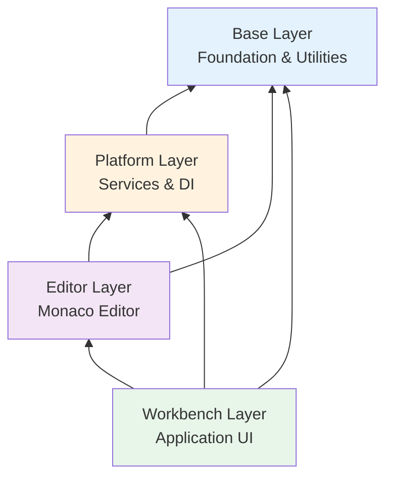
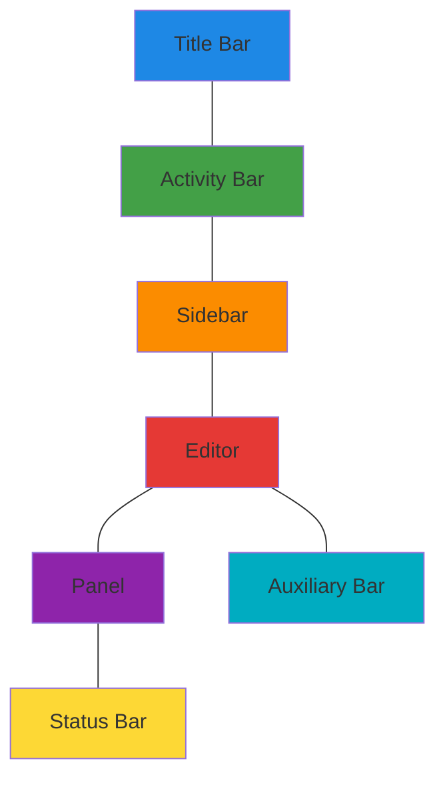

## Overview

Visual Studio Code follows a strict **layered architecture** where each layer builds upon the one below it. This design promotes code reusability, maintainability, and ensures that lower-level components remain independent of higher-level features.

<Note>
  **Key Rule**: Each layer can only depend on layers below it, never above. This is enforced using the `npm run valid-layers-check` command.
</Note>

## The Four Layers



## Layer 1: Base

**Location**: `src/vs/base/`

The base layer provides foundational utilities and cross-platform abstractions. It has no dependencies on any other VS Code layer.

### Structure

<Tabs>
  <Tab title="Common">
    **Location**: `src/vs/base/common/`
    
    Universal utilities that work in any JavaScript environment:
    
    - **Data Structures**: Arrays, maps, sets, trees, linked lists
    - **Async Primitives**: Promises, cancellation tokens, throttling, debouncing
    - **Events**: Event emitter implementation
    - **Lifecycle**: Disposable pattern for resource management
    - **Strings**: String manipulation utilities
    - **URI**: Universal resource identifier handling
    
    ```typescript
    // Example: Disposable pattern from src/vs/base/common/lifecycle.ts
    import { Disposable } from 'vs/base/common/lifecycle';
    
    export class MyComponent extends Disposable {
      constructor() {
        super();
        
        // Register disposables that will be cleaned up
        this._register(someEventListener);
        this._register(someResource);
      }
    }
    ```
  </Tab>
  
  <Tab title="Browser">
    **Location**: `src/vs/base/browser/`
    
    Browser-specific utilities:
    
    - **DOM Utilities**: DOM manipulation and querying
    - **UI Components**: Basic widgets (buttons, lists, trees)
    - **Mouse & Keyboard**: Input handling
    - **CSS**: Dynamic styling utilities
    - **Drag & Drop**: Drag and drop handling
    
    ```typescript
    // Example: DOM utilities
    import { $, append } from 'vs/base/browser/dom';
    
    const container = $('.my-container');
    append(container, $('.child-element'));
    ```
  </Tab>
  
  <Tab title="Node">
    **Location**: `src/vs/base/node/`
    
    Node.js-specific utilities:
    
    - **File System**: File operations
    - **Process**: Process management
    - **Streams**: Node.js stream handling
    - **Crypto**: Cryptographic operations
    
    <Warning>
      Node utilities are only available in desktop (Electron) environments, not in web.
    </Warning>
  </Tab>
</Tabs>

### Key Concepts

<AccordionGroup>
  <Accordion title="Disposables">
    The `IDisposable` interface is fundamental to VS Code's resource management:
    
    ```typescript
    // src/vs/base/common/lifecycle.ts:312
    export interface IDisposable {
      dispose(): void;
    }
    
    // Usage examples:
    
    // 1. DisposableStore - manage multiple disposables
    const store = new DisposableStore();
    store.add(eventListener1);
    store.add(eventListener2);
    store.dispose(); // Disposes all
    
    // 2. MutableDisposable - replace disposable values
    const mutable = new MutableDisposable();
    mutable.value = resource1;
    mutable.value = resource2; // Disposes resource1 automatically
    
    // 3. Disposable base class
    class MyClass extends Disposable {
      constructor() {
        super();
        this._register(myDisposable);
      }
    }
    ```
    
    <Info>
      **Critical Rule**: Always register disposables immediately after creation. Use `DisposableStore`, `MutableDisposable`, or `DisposableMap` to manage them.
    </Info>
  </Accordion>
  
  <Accordion title="Events">
    Type-safe event system used throughout VS Code:
    
    ```typescript
    // src/vs/base/common/event.ts
    import { Emitter, Event } from 'vs/base/common/event';
    
    class MyService {
      private readonly _onDidChange = new Emitter<string>();
      readonly onDidChange: Event<string> = this._onDidChange.event;
      
      private fireChange(value: string): void {
        this._onDidChange.fire(value);
      }
    }
    
    // Usage:
    const disposable = myService.onDidChange(value => {
      console.log('Changed:', value);
    });
    ```
  </Accordion>
</AccordionGroup>

## Layer 2: Platform

**Location**: `src/vs/platform/`

The platform layer provides core services and the dependency injection infrastructure. Services in this layer are shared across the editor and workbench.

### Key Services

<Steps>
  <Step title="Instantiation Service">
    **Location**: `src/vs/platform/instantiation/common/instantiation.ts`
    
    The dependency injection container that manages service lifecycles:
    
    ```typescript
    // Creating a service identifier
    import { createDecorator } from 'vs/platform/instantiation/common/instantiation';
    
    export const IMyService = createDecorator<IMyService>('myService');
    
    export interface IMyService {
      readonly _serviceBrand: undefined;
      doSomething(): void;
    }
    ```
  </Step>
  
  <Step title="Configuration Service">
    **Location**: `src/vs/platform/configuration/common/configuration.ts`
    
    Manages all VS Code settings with support for multiple scopes.
  </Step>
  
  <Step title="File Service">
    **Location**: `src/vs/platform/files/common/files.ts`
    
    Abstraction over file system operations with support for multiple providers.
  </Step>
  
  <Step title="Storage Service">
    **Location**: `src/vs/platform/storage/common/storage.ts`
    
    Persistent key-value storage with workspace and global scopes.
  </Step>
  
  <Step title="Log Service">
    **Location**: `src/vs/platform/log/common/log.ts`
    
    Centralized logging system with different log levels.
  </Step>
</Steps>

### Platform Architecture

```typescript
// Example service implementation
import { createDecorator } from 'vs/platform/instantiation/common/instantiation';
import { ILogService } from 'vs/platform/log/common/log';

export const IExampleService = createDecorator<IExampleService>('exampleService');

export interface IExampleService {
  readonly _serviceBrand: undefined;
  performAction(): Promise<void>;
}

export class ExampleService implements IExampleService {
  declare readonly _serviceBrand: undefined;
  
  constructor(
    @ILogService private readonly logService: ILogService
  ) {
    this.logService.info('ExampleService initialized');
  }
  
  async performAction(): Promise<void> {
    this.logService.info('Action performed');
  }
}
```

## Layer 3: Editor

**Location**: `src/vs/editor/`

The editor layer implements the **Monaco Editor**, which is the core text editing component of VS Code. Monaco can be used as a standalone library.

### Editor Components

<CardGroup cols={2}>
  <Card title="Core Editor" icon="file-code">
    - Text buffer and model
    - Cursor and selection management
    - View rendering
    - Editor options and configuration
  </Card>
  
  <Card title="Language Features" icon="language">
    - Tokenization and syntax highlighting
    - Language services integration
    - IntelliSense and completions
    - Code actions and quick fixes
  </Card>
  
  <Card title="Editor Widgets" icon="window">
    - Content widgets
    - Overlay widgets
    - Glyphs and decorations
    - Hover providers
  </Card>
  
  <Card title="Browser Integration" icon="browser">
    - Standalone editor support
    - Diff editor
    - Configuration editor
    - Editor commands
  </Card>
</CardGroup>

### Editor Structure

```plaintext
src/vs/editor/
├── common/           # Core editor logic
│   ├── model/       # Text model implementation
│   ├── languages/   # Language features
│   └── services/    # Editor services
├── browser/         # Browser-specific editor
│   ├── widget/      # Editor widgets
│   └── services/    # Browser editor services
├── contrib/         # Editor contributions
│   ├── hover/       # Hover support
│   ├── suggest/     # IntelliSense
│   └── ...
└── standalone/      # Standalone Monaco editor
```

## Layer 4: Workbench

**Location**: `src/vs/workbench/`

The workbench layer is the main application that brings everything together. It provides the VS Code UI and all user-facing features.

### Workbench Structure

<Tabs>
  <Tab title="Browser">
    **Location**: `src/vs/workbench/browser/`
    
    Core workbench UI components:
    
    - **Parts**: Title bar, activity bar, sidebar, editor, panel, status bar
    - **Layout**: Window layout management
    - **Actions**: Command and action infrastructure
    - **Workbench**: Main workbench class
    
    ```typescript
    // src/vs/workbench/browser/workbench.ts:67
    export class Workbench extends Layout {
      constructor(
        parent: HTMLElement,
        private readonly options: IWorkbenchOptions | undefined,
        private readonly serviceCollection: ServiceCollection,
        logService: ILogService
      ) {
        super(parent, { resetLayout: Boolean(options?.resetLayout) });
        this.registerErrorHandler(logService);
      }
      
      startup(): IInstantiationService {
        // Initialize services, layout, and contributions
        const instantiationService = this.initServices(this.serviceCollection);
        // ...
        return instantiationService;
      }
    }
    ```
  </Tab>
  
  <Tab title="Services">
    **Location**: `src/vs/workbench/services/`
    
    Workbench-specific service implementations:
    
    - **Editor Service**: Editor management
    - **Viewlet Service**: Sidebar panels
    - **Panel Service**: Bottom panel
    - **Lifecycle Service**: Application lifecycle
    - **Extension Service**: Extension management
  </Tab>
  
  <Tab title="Contrib">
    **Location**: `src/vs/workbench/contrib/`
    
    Feature contributions that extend the workbench:
    
    - `git/`: Git integration
    - `debug/`: Debugging features
    - `search/`: Search functionality
    - `terminal/`: Integrated terminal
    - `tasks/`: Task runner
    - `extensions/`: Extension marketplace
    
    Each contribution is self-contained and registers with extension points.
  </Tab>
  
  <Tab title="API">
    **Location**: `src/vs/workbench/api/`
    
    Extension host and VS Code API implementation:
    
    - Extension host process management
    - API implementation for extensions
    - Extension activation and lifecycle
  </Tab>
</Tabs>

### Workbench Parts



## Layer Validation

VS Code enforces layer dependencies using a validation tool:

```bash
# Check for layer violations
npm run valid-layers-check
```

<Warning>
  **Common violations**:
  - Importing from a higher layer (e.g., `base` importing from `platform`)
  - Importing platform-specific code in common modules
  - Circular dependencies between layers
</Warning>

## Benefits of Layered Architecture

<AccordionGroup>
  <Accordion title="Code Reusability">
    Lower layers can be reused in different contexts:
    - Monaco Editor can be used standalone
    - Base utilities work in any JavaScript environment
    - Platform services can be shared across different UIs
  </Accordion>
  
  <Accordion title="Maintainability">
    Clear boundaries make the codebase easier to understand:
    - Developers know where to find specific functionality
    - Changes are isolated to specific layers
    - Testing is simplified with clear dependencies
  </Accordion>
  
  <Accordion title="Scalability">
    The architecture supports growth:
    - New features are added as contributions
    - Services can be extended without modifying core code
    - Platform abstractions enable new runtimes (web, desktop)
  </Accordion>
</AccordionGroup>

## Next Steps

<CardGroup cols={2}>
  <Card title="Dependency Injection" icon="syringe" href="/concepts/dependency-injection">
    Learn how services are created and managed
  </Card>
  <Card title="Contribution Model" icon="puzzle-piece" href="/concepts/contribution-model">
    Understand how features extend the workbench
  </Card>
</CardGroup>